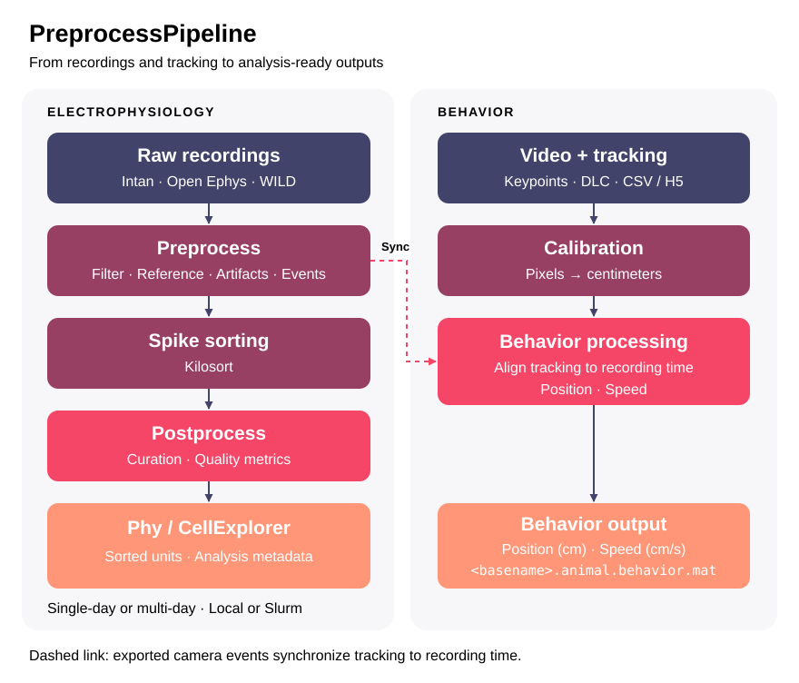

# PreprocessPipeline

A GUI for electrophysiology preprocessing, Kilosort spike sorting, and
postprocessing, with Phy and CellExplorer-compatible outputs and behavior tracking
calibration, synchronization, and export. Supports Intan,
Open Ephys, merged WILD recordings, single-day and multi-day sessions, and
local or Slurm execution on Linux and Windows.



## Installation

Requires Git and [uv](https://docs.astral.sh/uv/getting-started/installation/)
or Conda/Miniforge. GPU sorting requires a compatible GPU and CUDA driver;
MATLAB-based sorters also require MATLAB. The GUI needs a desktop or remote
display connection and system Qt libraries.

```bash
git clone https://github.com/yoshihito-saito/PreprocessPipeline.git
cd PreprocessPipeline
```

### uv

```bash
python scripts/setup_uv.py
source .venv/bin/activate
preprocess-gui
```

On Windows PowerShell, activate with `.venv\Scripts\Activate.ps1`.
For a CPU environment, use `python scripts/setup_uv.py --torch-backend cpu`.
Setup creates a Python 3.11 `.venv`; rerunning it updates the existing environment.
Use the activated environment to launch the GUI.

### Conda

```bash
python scripts/setup_env.py
conda activate preprocess
preprocess-gui
```

Rerunning setup updates an existing environment. Setup uses the customized
Kilosort4 source in `sorter/Kilosort4`; keep the repository checkout available.

## Basic use

### Single-day session

1. Click **Browse basepath** and select the raw recording directory.
2. Click **Browse local** and choose a **Local working dir** for processed outputs.
3. Under **Ephys > Preprocess**, review the channel map, exclusions, filtering,
   reference, LFP, events, and Sorting settings.
4. Configure unit processing under **Ephys > Postprocess**.
5. Under **Ephys > Run**, select **Local** or **Slurm**, set Stage resources,
   and start the Run.

### Multi-day session

Use **Browse for multi-days**, select day directories in processing order,
choose the subepochs to include, and enter a unique **Multi-day name**.
Review the common channel map and settings, then start from **Ephys > Run**.

### Run options

- **Run all:** preprocess, sort when enabled, and postprocess.
- **Preprocess only:** preprocess and also sort when `run_sorter` is enabled.
- **Postprocess only:** process an existing Kilosort/Phy result.

Save and restore settings with **Save config** and **Load config**.
**Open config** edits a session-local copy of the sorter configuration.

### Channels and external sorting

GUI and configuration channel indices are **0-based**. CellExplorer channel
values saved to MATLAB files are **1-based**.

Preprocessing retains the full binary channel columns; `zero_bad=True` zeroes
bad channels. Analysis excludes bad channels while preserving original channel
IDs. Review the channel map and exclusions before running.

For external sorting, select its folder and the matching **Postprocess recording**.
The recording's channel columns, sample order, and time origin must match the
sorting. Enable `apply_preprocess` for raw inputs that need filtering/reference.

### Behavior

The **Behavior** tab loads keypoint tracking CSV/H5 files from recording
subfolders. Use **Discover tracking files**, select a bodypart, and calibrate
the video before previewing or exporting positions in centimeters.

## Local and Slurm runs

For Slurm, set CPU and memory for each Stage. Sorting requests one GPU when
required. Submission needs Slurm client commands; input/output paths and required
sorter installations must be accessible from the compute node.

Closing the GUI does not cancel a persistent Run. **Force stop** requests
cancellation of active Stages in the current Run. Keep logs and Run metadata under:

```text
<local-working-directory>/.pipeline/<run-id>/
```

## Resume and save outputs

Use **Browse local session to resume** and select the processed session directory
itself. The GUI restores saved settings; browsing does not submit a job.
With `overwrite=False`, compatible completed outputs are reused. Review settings
before restarting; incompatible outputs require an explicit overwrite.

Use **Copy outputs to storage** for final storage. Local outputs are retained by
default. **Delete local after verified copy** removes the complete local session
only after the copy is verified and published. Copied destination files and
directories are made readable and writable by all users.

Main session outputs include:

- `<basename>.dat`, optional `.lfp`, and `.session.mat`.
- Event and optional state-scoring MAT files.
- `preprocess_run.yaml` and `preprocess.log`.
- `Kilosort_<timestamp>/` sorting results.

## Documentation

- [Parameter reference](docs/parameters.md): configuration keys, defaults, and units.
- [CLI guide](docs/cli.md): direct runs, multi-day sessions, external sorting, and Local/Slurm Runs.

## Tests

See [tests/README.md](tests/README.md) for test groups and execution commands.
GitHub Actions runs selected basic regressions on Linux and Windows.
